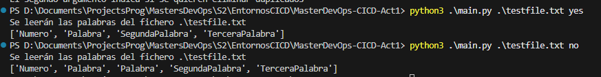

# Repo para EIEC - DevOps - UNIR

Este repositorio nos servirá para demostrar el uso de Git en la asignatura de EIEC y muchas cosas mas.

---

Los comandos del Makefile funcionarán en Linux y MacOS. En caso de usar Windows, necesitarás adaptarlos o ejecutarlos en una máquina virtual Linux.

## Ejecución

python3 main.py <filename> <dup>
filename: **ruta** al fichero que contiene la lista de palabras, una por línea
dup: **yes|no**, yes para eliminar palabras duplicadas, no para mantener la lista
order: **asc|desc**, asc ascendete, desc descendente, por defecto es ascendente
                          
## Integrantes

Los participantes de esta actividad han sido:

- Aceves Siordia, Kevin Damian
- Cayoja Perez, Alex
- Parra Sua, Yohn Eduin
- Mendez Rivas, Guaroa Bienvenido
- Serrano Arenas, Juan Sebastian

## Pruebas

Ejemplo de un caso donde se pide que se eliminen las palabras duplicadas y otro donde no.

